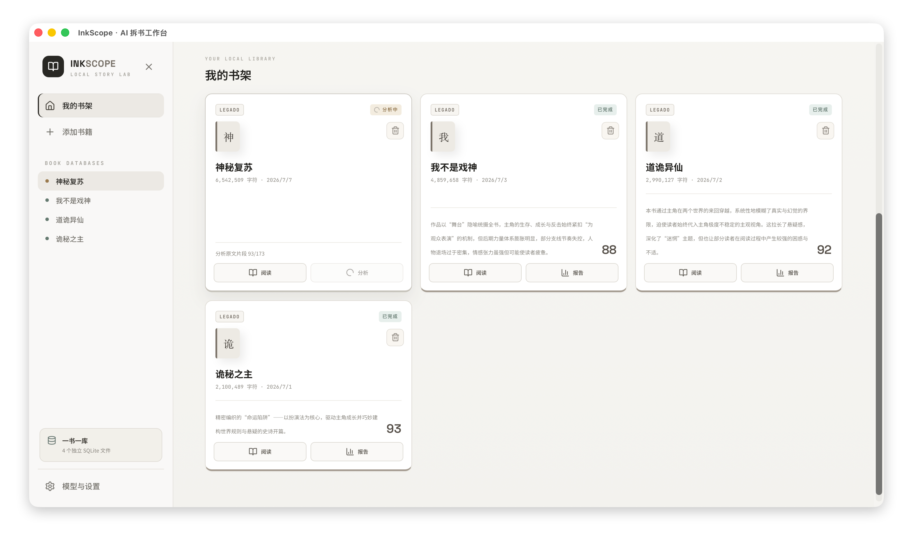
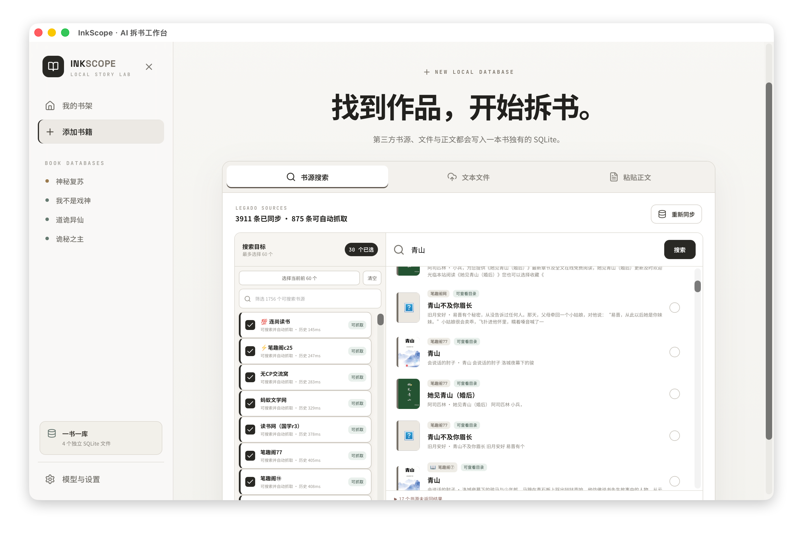
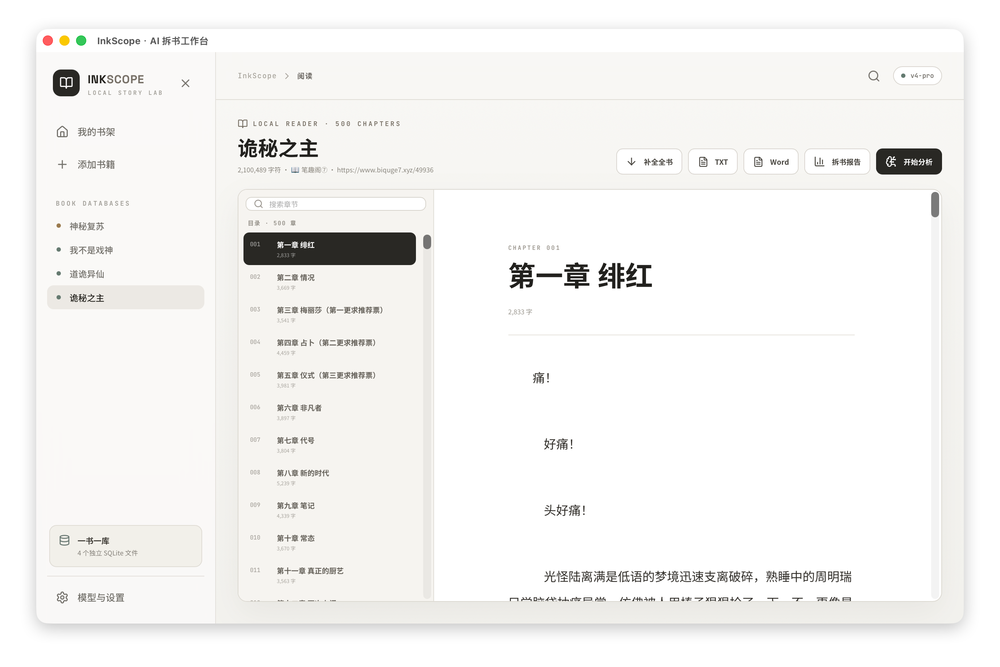
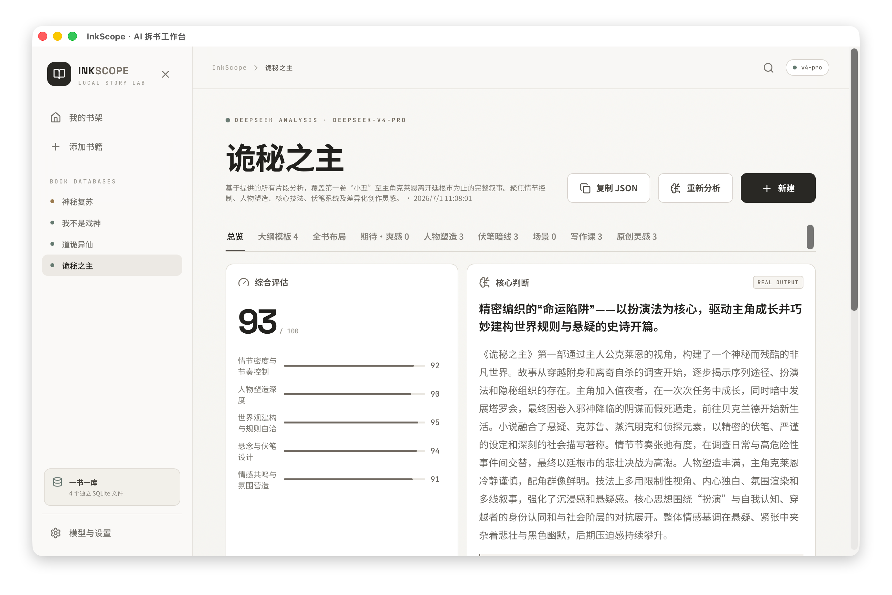

# InkScope

InkScope 是一个写给小说作者的本地 AI 拆书与阅读客户端。

它不是单纯的“剧情总结器”，而是把一部长篇小说拆成作者可以学习的写作工程：开篇、铺垫、主线、辅线、暗线、人物弧光、伏笔回收、期待感、爽感、高潮与结尾。目标是帮助作者从优秀作品里提取结构经验，再迁移到自己的原创作品中。

当前版本基于 React + Tauri 2 + Rust + SQLite + DeepSeek。

## 软件截图

<table>
  <tr>
    <td width="50%">
      
      <br />
      <sub>本地书架：一书一库，阅读与报告入口集中管理。</sub>
    </td>
    <td width="50%">
      
      <br />
      <sub>书源搜索：同步 Legado 书源，按小说名选择目标并导入。</sub>
    </td>
  </tr>
  <tr>
    <td width="50%">
      
      <br />
      <sub>本地阅读器：章节目录、全文阅读、导出与分析入口。</sub>
    </td>
    <td width="50%">
      
      <br />
      <sub>拆书报告：结构评分、写作技法、期待爽感与大纲模板。</sub>
    </td>
  </tr>
</table>

## 核心能力

- 本地书架：每本书一个独立 SQLite 数据库。
- 第三方书源：支持同步 aoaostar/legado 书源，根据小说名搜索并选择结果。
- 全书下载：加入书架前先下载章节，下载后可本地阅读和分析。
- 本地阅读器：支持章节目录、章节搜索、上一章/下一章、补全旧版下载数据。
- 导出书籍：支持导出 TXT 和 Word/DOCX。
- AI 拆书：调用 DeepSeek 对长篇文本进行分片分析，再合成结构化报告。
- 写作教学型报告：面向新人作者解释“作者为什么这样写”和“自己如何迁移”。
- 大纲模板：根据拆书报告生成分卷、五幕式、关键剧情、高潮阶梯、主线/暗线与可复制的新书大纲模板。

## 拆书报告包含什么

InkScope 的报告重点不是复述剧情，而是反推作者的施工图：

- 全书布局：故事发动机、主线因果链、辅线服务方式、暗线埋设与揭示。
- 五幕式大纲：开篇入局、目标成形、对抗升级、汇线爆发、回收余波。
- 分卷卷纲：每卷的结构作用、关键剧情、卷内高潮、卷尾钩子。
- 期待感与爽感：立期待、延迟、加码、兑现、下一钩子。
- 人物塑造：出场、欲望、恐惧、成长、关系推动、阶段退场。
- 伏笔暗线：如何伪装进正常叙事，何时回收，回收带来的认知与情绪效果。
- 场景拆解：场景任务、切入方式、感官描写、场内冲突、转场。
- 写作课：把原作做法转成可执行步骤、常见误区和练习题。
- 原创灵感：给出可迁移方向，同时提示如何避免复制原作。

## 真实数据原则

InkScope 不内置示例书，也不展示固定假报告。

- 原文、章节、切片摘要、任务进度、模块缓存和最终报告都来自本地 SQLite。
- 每本书拥有自己的 `.sqlite` 文件，互不混用。
- 分析进度读取真实任务状态，不用假进度条。
- 分析失败后会复用已经完成的片段与模块缓存，避免从零白跑。
- DeepSeek API Key 只保存在当前设备 WebView 的 `localStorage`，不会写进书籍数据库。
- 书源 JavaScript 不会执行，避免第三方规则获得本机权限。
- 书源请求会阻止访问 localhost 和内网 IP。

macOS 默认数据目录：

```text
~/Library/Application Support/com.inkscope.storylab/
```

书籍数据库目录：

```text
~/Library/Application Support/com.inkscope.storylab/books/<book-id>.sqlite
```

书源配置：

```text
~/Library/Application Support/com.inkscope.storylab/sources/legado.json
```

默认书源同步地址：

```text
https://legado.aoaostar.com/sources/b778fe6b.json
```

## DeepSeek 支持

客户端当前按 OpenAI 兼容格式调用 DeepSeek。

默认 Base URL：

```text
https://api.deepseek.com
```

可选模型：

- `deepseek-v4-flash`
- `deepseek-v4-pro`

应用会尽量使用 JSON Output，并对模型偶发的 JSON 截断、控制字符和格式问题做重试与修复。但长篇小说分析依然会受到网络、模型输出长度和 API 稳定性的影响。

## 开发环境

需要：

- Node.js
- npm
- Rust stable
- Tauri 2 所需系统依赖

安装依赖：

```bash
npm install
```

启动 Tauri 客户端：

```bash
npm run tauri
```

只启动前端页面：

```bash
npm run dev
```

注意：`npm run dev` 只能查看界面，不能使用 SQLite、书源抓取和 DeepSeek 分析。完整功能必须通过 Tauri 客户端运行。

## 构建与检查

前端构建：

```bash
npm run build
```

Rust 测试：

```bash
cd src-tauri
cargo test
```

打包客户端：

```bash
npm run tauri:build
```

## 项目结构

```text
.
├── src/                  # React 前端
│   ├── App.tsx           # 主界面、书架、阅读器、报告页
│   ├── lib/tauri.ts      # 前端调用 Tauri command
│   ├── styles.css        # 亮色极简 UI
│   └── types.ts          # 报告和书籍类型
├── src-tauri/            # Tauri / Rust 后端
│   ├── src/lib.rs        # SQLite、任务、DeepSeek、导出
│   ├── src/legado.rs     # Legado 书源解析与抓取
│   └── tauri.conf.json
├── scripts/              # 开发与构建脚本
└── README.md
```

## 当前限制

- Legado 规则生态很复杂，当前只支持常见 JSONPath、CSS、class、tag 等规则；依赖 JavaScript、登录态或特殊加密的书源会被跳过或标记失败。
- 起点、番茄等官方站点并非主要抓取目标，建议通过第三方 Legado 书源搜索。
- AI 拆书质量取决于下载文本质量和模型稳定性。
- 大纲模板是写作学习工具，不应复制原作人物、专名、设定或核心事件。

## 隐私与版权提示

InkScope 面向个人本地阅读和写作学习。请只导入你拥有合法阅读和私人分析权限的内容。不要把受版权保护的全文、报告或导出文件用于未授权传播。

## License
