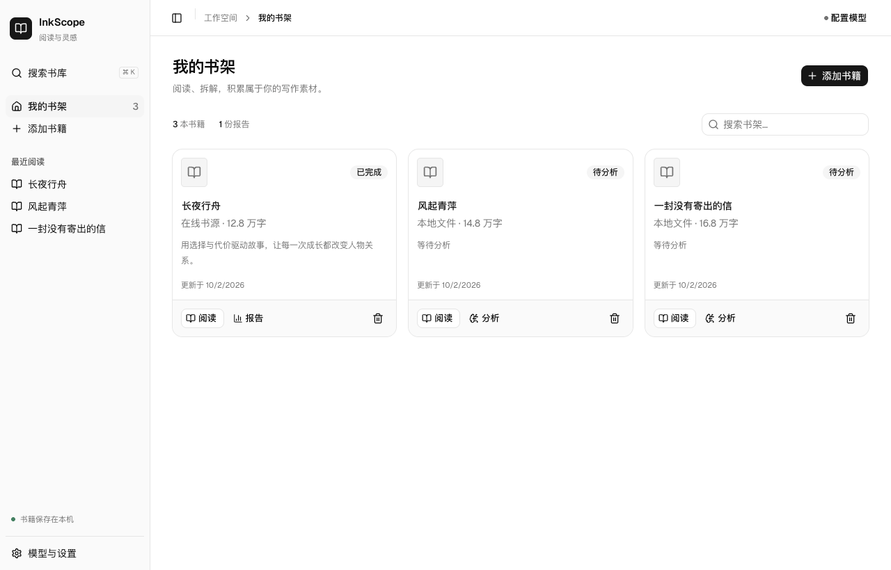
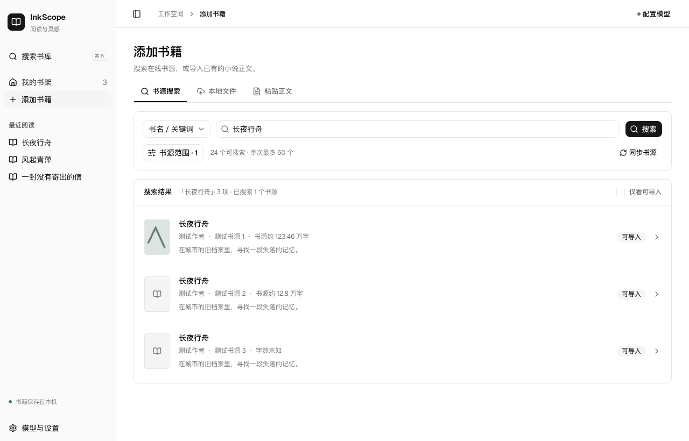
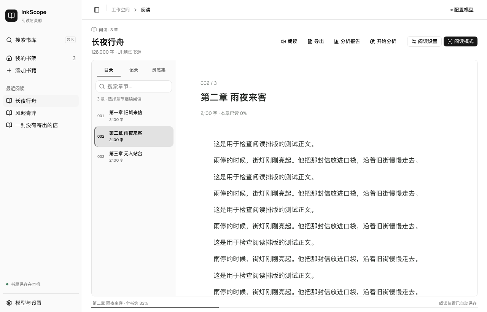
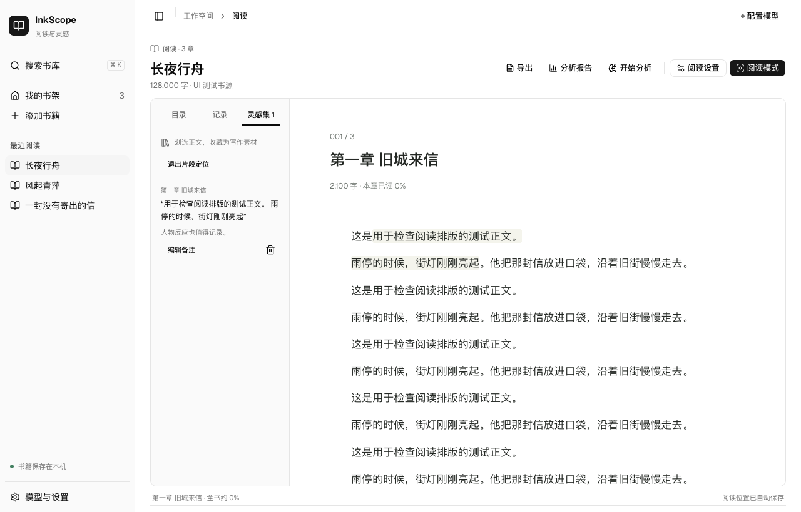
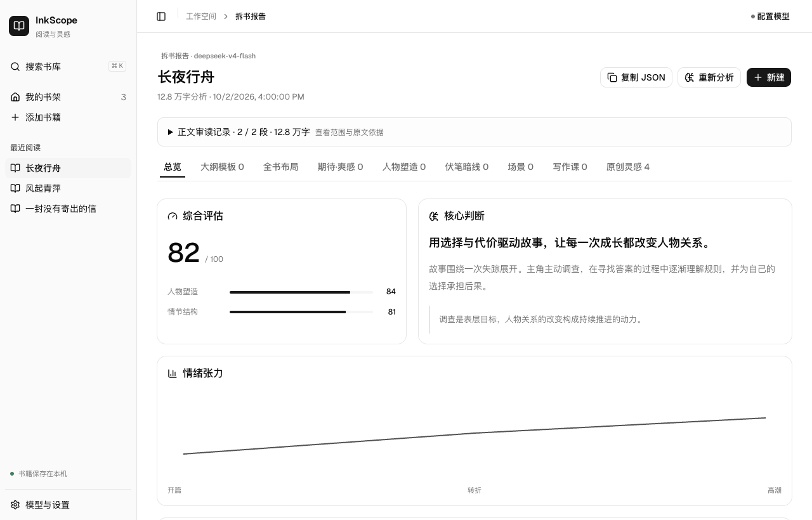
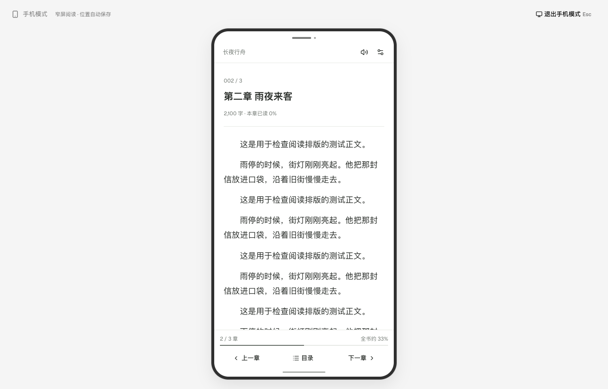
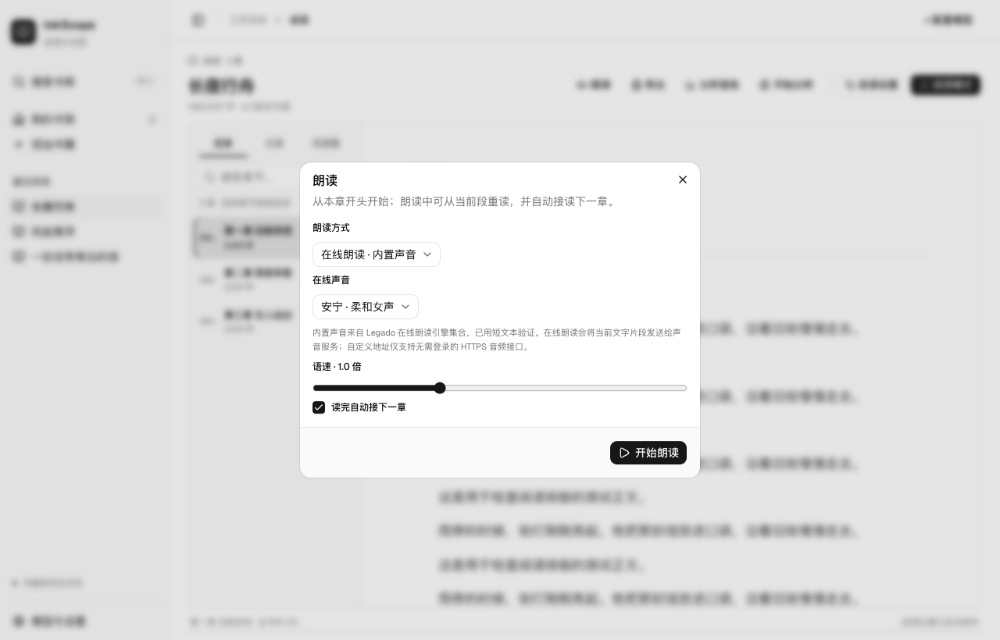
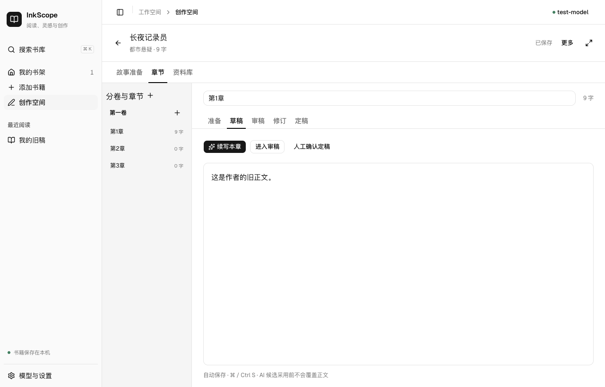
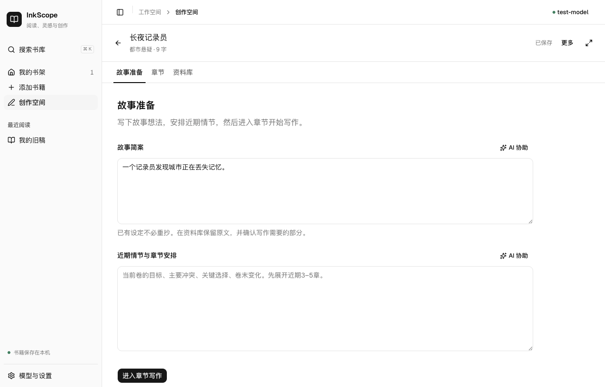

# InkScope

InkScope 是一个连接阅读、灵感与长篇创作的本地小说工作空间：把在线书源或本地正文加入书架，阅读、朗读并收藏片段；通过 AI 分析研究作品写法，再进入创作空间，完成原创策划、分卷规划、章节写作和修订。

阅读、片段收藏和手动写作不依赖 AI 模型。分析功能会基于已保存的正文审读开篇、布局、人物、伏笔与情绪兑现，帮助作者理解作品的写法，并把可迁移的经验用于原创构思。

当前版本基于 React + Tauri 2 + Rust + SQLite + DeepSeek。

## 软件截图

以下截图由当前版本的界面测试生成；书籍、书源和分析内容均为演示数据。

<table>
  <tr>
    <td width="50%">
      
      <br />
      <sub>本地书架：最近阅读、书籍状态和报告入口。</sub>
    </td>
    <td width="50%">
      
      <br />
      <sub>书源搜索：按书名或作者查找，选择书源后预览并导入。</sub>
    </td>
  </tr>
  <tr>
    <td width="50%">
      
      <br />
      <sub>阅读器：章节目录、阅读记录、朗读入口与外观设置。</sub>
    </td>
    <td width="50%">
      
      <br />
      <sub>阅读模式：隐藏导航和工作台操作，专注正文。</sub>
    </td>
  </tr>
  <tr>
    <td width="50%">
      
      <br />
      <sub>片段灵感集：划选正文、收藏片段并添加备注。</sub>
    </td>
    <td width="50%">
      
      <br />
      <sub>拆书报告：正文审读记录、结构评估与创作灵感。</sub>
    </td>
  </tr>
</table>

手机模式将正文放进独立的窄屏区域，保留朗读、外观设置与底部翻章操作：



朗读设置可直接选择内置在线声音，无需填写引擎地址：



创作空间分为「故事准备 · 章节 · 资料库」，围绕每一章完成准备、草稿、审稿、修订与定稿。AI 协作按需展开。





## 核心能力

- 创作空间：支持新建作品、导入自己的 TXT / Markdown 稿件或复制书架章节，独立管理作品策划、世界规则、人物关系、分卷大纲、正文事实与文风约定；可增加分卷、章节，专注写作并导出 TXT / Word。
- 创作协作：根据当前阶段提供完善故事、规划章节、起草 / 续写、检查与选段润色，内置技能在后台调用。结果按文档隔离，采用前预览；选段润色只替换对应片段，审稿意见不会直接写入正文。素材和高级约定按需打开。
- 创作保存：正文与作品档案自动保存在本地 SQLite，支持手动保存和历史版本预览、恢复。并发保存有版本检查；候选生成后作品已修改时，禁止直接覆盖。当前编辑草稿另有本机恢复副本。
- 本地书架：每本书一个独立 SQLite 数据库。
- 第三方书源：支持同步 aoaostar/legado 书源，按书名或作者搜索，并筛选可导入的结果。
- 书源正文下载：加入书架时自动下载当前书源目录的全部章节，显示已完成章数和百分比；有章节失败时不导入半本书。“全部”指下载时的书源目录，不代表连载作品已经完结。
- 本地阅读器：支持章节目录与搜索、章节切换、以“字”为单位显示章节字数、自动保存阅读位置和最近阅读记录；可调整背景（含柔和浅绿护眼色）、字号、字体、行距、段距和页宽，并通过阅读模式隐藏工作台操作。旧版书源书籍如缺正文，会在分析前下载完整目录。
- 手机模式：在阅读页点击“手机模式”，将正文放进居中的手机外框，随窗口高度适配窄屏宽度；底部可翻章或打开目录、记录与灵感集。阅读主题、字号、朗读和片段收藏共用，切换时保留阅读位置，按 Esc 或点击“退出手机模式”返回。
- 章节朗读：在阅读页点击“朗读”，选择系统语音或 12 款内置在线声音即可开始；支持语速调节、暂停/继续、停止、当前段落高亮及读完自动接下一章。内置声音从 [Legado 在线朗读引擎集合](https://legado.aoaostar.com/#id_2) 中筛选并以短文本验证。高级选项保留自定义引擎地址，支持无需登录的 HTTPS GET 音频接口；在线模式会把正在朗读的文字片段发送给所选声音服务，服务的可用性取决于第三方。
- 片段灵感集：划选正文片段并添加备注，按书保存在本地数据库；可回到原章节、编辑备注和删除收藏。
- 导出书籍：支持导出 TXT 和 Word/DOCX。
- AI 拆书：书源书籍仅在本地保存当前目录全部章节后开始分析；随后逐段审读正文、核对每段前中后的原文引用，最后综合跨段线索与结构化报告。模型引文若无法对应原文，会标为待复核并继续处理后续片段，不会将其当作已核验依据。本地导入文件是否为作品全本仍由使用者确认。
- 写作教学型报告：面向新人作者解释“作者为什么这样写”和“自己如何迁移”。
- 大纲模板：根据拆书报告生成分卷、五幕式、关键剧情、高潮阶梯、主线/暗线与可复制的新书大纲模板。

## 长篇创作怎么使用

1. **准备故事**：创建时只需命名，可选导入已有内容。空白作品直接进入故事准备，已有正文进入章节，导入设定进入资料库。导入时区分正文、设定与大纲、参考资料；完整原文只读保留，设定按条目整理，不计入正文字数。故事准备页维护故事简案、全书方向和当前卷安排。
2. **准备本章**：添加分卷与章节，明确本章目标、冲突、结果和出场人物，勾选相关资料。人物、规则、事实和伏笔分别维护，待确认资料明确标注状态。
3. **写草稿**：可以直接写作，也可以按需起草、续写或选段润色。AI 候选先预览再采用，不直接覆盖正文。专注写作隐藏导航，Esc 返回。
4. **审稿与修订**：人工添加意见，或生成 AI 审稿后逐条编辑、选择并确认。修订基于确认意见生成独立候选，对照原稿后采用。正文修改后，旧审稿需要重新确认，过期候选禁止覆盖。
5. **定稿与记录**：作者确认后保存不可直接修改的定稿快照。需要修改时创建修订版，旧定稿保留。可基于当前定稿生成章节记录，核对确认后进入资料库，并保存来源章节与定稿信息；未经确认的草稿记录不会自动进入后续写作资料。
6. **继续下一章**：完成当前章后进入下一章，也可以暂不整理记录继续写作。更多菜单提供历史版本、导出和作品设置；误导入的章节可在资料库纠正用途，保留文本和历史。

内置写作方法参考 `novel-chapter-review`，流程参考 [AI-Novel-Writer](https://github.com/EthanYoQ/AI-Novel-Writer)、[Vela](https://github.com/heider-x/vela) 的章节协作与资料组织方式，并借鉴 [chinese-novelist-skill](https://github.com/PenglongHuang/chinese-novelist-skill) 的先规划、逐章写作和记录衔接。按题材及章节功能使用，不固定每章反转、对白比例或高潮，不保证市场表现。技能源码位于 `src-tauri/src/prompts/creation/`，随应用打包；正常写作无需手动选择技能。

创作 AI 沿用「模型与设置」中的 API 配置。每次提交作品档案、当前文档及有限的最近/相关前文章节，候选旁显示资料范围；较长资料会明确截取。全文始终保存在本地，但单次创作请求不是全书审读。正文候选以普通文本保存，避免让正文受严格 JSON 格式校验影响；未完成输出会提示并保留。点击生成会将此次资料发送至所配置的模型服务。

创作项目、历史版本及候选记录保存在应用数据目录的 `creations.sqlite` 中，与阅读书库分离。全部创作作品共用这个数据库，按作品 ID 隔离，正文和资料存为项目 JSON；阅读书架则在 `books/` 下每本一个 SQLite。macOS 默认目录为 `~/Library/Application Support/com.inkscope.storylab/`。创作列表每行提供删除按钮，确认后删除该作品及其版本和 AI 记录，清除本机草稿；不影响原书架、收藏及导出文件。AI 任务运行中暂不可删除。历史面板显示最近 100 个文档版本，普通候选面板显示最近 50 个任务，并保留已接受的事实整理记录供来源复核。当前提供单章准备、草稿、审稿、修订、定稿的完整流程和带来源的章节记录；跨卷时间轴、自动人物状态表和全书一致性审计仍待后续扩展。

## 拆书报告包含什么

InkScope 的报告重点不是复述剧情，而是反推作者的施工图：

- 全书布局：故事发动机、主线因果链、辅线服务方式、暗线埋设与揭示。
- 五幕式大纲：开篇入局、目标成形、对抗升级、汇线爆发、回收余波。
- 分卷卷纲：每卷的结构作用、关键剧情、卷内高潮、卷尾钩子。
- 期待感与爽感：立期待、延迟、加码、兑现、下一钩子。
- 人物塑造：出场、欲望、恐惧、成长、关系推动、阶段退场。
- 伏笔暗线：如何伪装进正常叙事，何时回收，回收带来的认知与情绪效果。
- 场景拆解：场景任务、切入方式、感官描写、场内冲突、转场。
- 写作课：把原作做法转成可执行步骤、常见误区和练习题。
- 原创灵感：独立进行选题构思与二轮编辑审稿，生成起点、番茄各两个方案，包含读者需求、反常卖点、原作与新作的因果差异、前三章兑现、前30章升级与平台适配。平台判断是待试读验证的创作假设，不代表实时榜单结论或爆款保证。
- 旧版报告仍可阅读，并标明缺少新版原文覆盖记录。点击“重新分析”会按新版审读方法重新处理正文。

## 真实数据原则

InkScope 不内置示例书，也不展示固定假报告。

- 原文、章节、切片摘要、任务进度、模块缓存和最终报告都来自本地 SQLite。
- 每本书拥有自己的 `.sqlite` 文件，互不混用。
- 分析进度读取真实任务状态，不用假进度条。
- 分析会对短暂网络错误、限流、服务端错误和空白或截断的 JSON 输出进行有限重试。失败后复用输入未变化的片段记录及跨段综合结果；无法核对的模型引文会明确标为待复核，完成报告后重新分析会重新请求这些片段。正文、模型或相关输入变化时会使下游缓存失效，避免混用旧结果。
- DeepSeek API Key 只保存在当前设备 WebView 的 `localStorage`，不会写进书籍数据库。
- 系统语音由设备提供；在线朗读需要网络，且会向所选声音服务发送当前朗读片段。朗读偏好保存在当前设备的 WebView 中。
- 书源 JavaScript 不会执行，避免第三方规则获得本机权限。
- 书源请求会阻止访问 localhost 和内网 IP。

macOS 默认数据目录：

```text
~/Library/Application Support/com.inkscope.storylab/
```

书籍数据库目录：

```text
~/Library/Application Support/com.inkscope.storylab/books/<book-id>.sqlite
```

书源配置：

```text
~/Library/Application Support/com.inkscope.storylab/sources/legado.json
```

默认书源同步地址：

```text
https://legado.aoaostar.com/sources/b778fe6b.json
```

## DeepSeek 支持

客户端当前按 OpenAI 兼容格式调用 DeepSeek。

默认 Base URL：

```text
https://api.deepseek.com
```

可选模型：

- `deepseek-v4-flash`
- `deepseek-v4-pro`

应用会尽量使用 JSON Output，并对模型偶发的 JSON 截断、控制字符和格式问题做重试与修复。但长篇小说分析依然会受到网络、模型输出长度和 API 稳定性的影响。

## 开发环境

需要：

- Node.js
- npm
- Rust stable
- Tauri 2 所需系统依赖

安装依赖：

```bash
npm install
```

启动 Tauri 客户端：

```bash
npm run tauri
```

只启动前端页面：

```bash
npm run dev
```

注意：`npm run dev` 只能查看界面，不能使用 SQLite、书源抓取和 DeepSeek 分析。完整功能必须通过 Tauri 客户端运行。

## 构建与检查

前端构建：

```bash
npm run build
```

本机打包当前系统客户端：

```bash
npm run tauri:build
```

Tauri 桌面包通常需要在对应操作系统上构建：

- macOS：在 macOS 上生成 `.app` / `.dmg`
- Windows：在 Windows 上生成 `.msi` / NSIS 安装包
- Linux：在 Linux 上生成 `.deb` / AppImage

本仓库已提供 GitHub Actions 工作流：

```text
.github/workflows/build-desktop.yml
```

推送到 `main`、推送 `v*` tag，或在 GitHub Actions 页面手动运行 `Build desktop packages`，即可分别在 macOS、Windows 和 Ubuntu runner 上产出构建产物。构建结果会作为 workflow artifacts 上传。

## 发布版本

发布脚本会自动完成版本号同步、CHANGELOG 生成、release commit 和 git tag。

预览下一次 patch release：

```bash
npm run release -- patch --dry-run
```

生成本地 release commit 和 tag：

```bash
npm run release -- patch
```

也可以指定 `minor`、`major` 或明确版本号：

```bash
npm run release -- minor
npm run release -- 0.3.0
```

生成并推送到 GitHub：

```bash
npm run release:push -- patch
```

推送 tag 后会触发 `.github/workflows/build-desktop.yml`，自动构建 macOS、Windows 和 Linux 安装包，并上传到 GitHub Actions artifacts。

Rust 测试：

```bash
cd src-tauri
cargo test
```

## 项目结构

```text
.
├── src/                  # React 前端
│   ├── App.tsx           # 页面导航与主界面状态
│   ├── ReaderView.tsx    # 阅读器、朗读入口与片段收藏
│   ├── lib/speech-engines.ts # 内置在线声音
│   ├── lib/use-reader-speech.ts # 朗读播放控制
│   ├── lib/tauri.ts      # 前端调用 Tauri command
│   ├── styles.css        # 亮色极简 UI
│   └── types.ts          # 报告和书籍类型
├── src-tauri/            # Tauri / Rust 后端
│   ├── src/lib.rs        # SQLite、任务、DeepSeek、导出
│   ├── src/legado.rs     # Legado 书源解析与抓取
│   ├── src/speech.rs     # 在线朗读音频请求与地址校验
│   └── tauri.conf.json
├── scripts/              # 开发与构建脚本
└── README.md
```

## 当前限制

- Legado 规则生态很复杂，当前只支持常见 JSONPath、CSS、class、tag 等规则；依赖 JavaScript、登录态或特殊加密的书源会被跳过或标记失败。
- 起点、番茄等官方站点并非主要抓取目标，建议通过第三方 Legado 书源搜索。
- AI 拆书质量取决于下载文本质量和模型稳定性。
- 内置在线声音依赖第三方服务；服务接口变更或不可用时，可切换其他内置声音或系统语音。自定义在线引擎仅支持无需登录和脚本的 HTTPS GET 音频地址。
- 覆盖记录显示已提交模型的正文范围、逐条引用核对状态及待复核位置，不保证模型理解无遗漏。长篇会增加分析时间与模型用量；本地文件的全本完整性需由用户确认。
- 大纲模板是写作学习工具，不应复制原作人物、专名、设定或核心事件。

## 隐私与版权提示

InkScope 面向个人本地阅读和写作学习。请只导入你拥有合法阅读和私人分析权限的内容。不要把受版权保护的全文、报告或导出文件用于未授权传播。

## License
